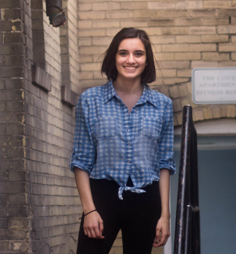

Dear star-children,

I have so much to thank you for.
You have given me the gift of working
with a truly extraordinary collection of
artists, teachers, administrators, and
other, less categorical individuals of
merit. I owe a debt of gratitude to my
staff; to the artists featured in this magazine, and the invaluable people who
support them; and to you, both reader
and star-child. Last year, I published
one of the first things I was proud of
in the 2015 issue of West Winds: a
poem called “stardust.” I would remind
you now that you are made from the
collision of stars, you are the product
of cosmic rubble, and a billion coincidences of exactly the right place and
exactly the right time, everything from
cells to solar systems, has brought
you here, to this moment and this
magazine.

I chose the theme of “Community” because, in all
truth, West Winds would be quite lost without you. This
is not to be mistaken for false humility; we should all
acknowledge that I went to every coffee shop in Salt
Lake City to work on this publication and I left at least
three years of my life in between these pages. But
without the awe-inspiring artists of West High, my caffeine consumption would have been in vain. I strove
to make a magazine that honored a whole community,
and I humbly hope I was successful.

From freshman year on, West Winds was salvation for me. This club brought me the courage to wear
red lipstick, an eclectic group of pink-haired and eloquent friends, and the realization of my voice as a
writer. I hope that it can bring some measure of magic to you, dear. Inside these hallowed walls exists a
testimony to human experience; somehow, the pieces
pressed in this magazine brought the stories of a complicated, epic community to life and preserved them
for an eternity. This is a community—furthermore, a
home—that I hope you all find, in your own right and
your own way.

In closing, I have one last bit of hard-earned wisdom for you; steel yourself appropriately. Your art matters. Your voice matters. You would not be here if this
world didn’t need to hear what you have to say, so
please, keep creating your art. There is so much value in what you are doing—tangible value, in the case
of this magazine. Support your fellow artists; it costs
nothing to encourage people’s dreams, but it pays off
tremendously, and we would be a sorry lot without
one another. Support yourself; you weren’t made out
of stars for nothing, after all.

I have had the honor to be your editor, and I will
never forget that.

With love,

Isabelle Srivastava
